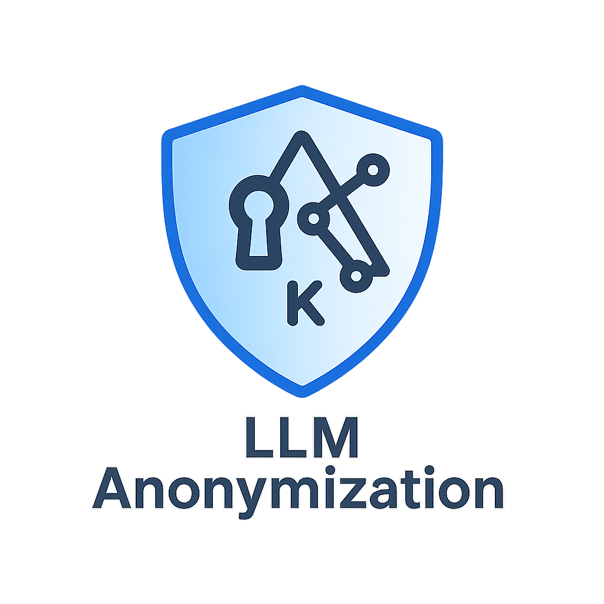
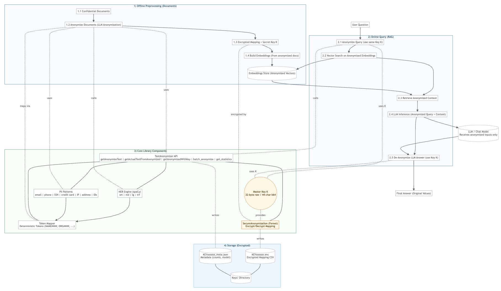
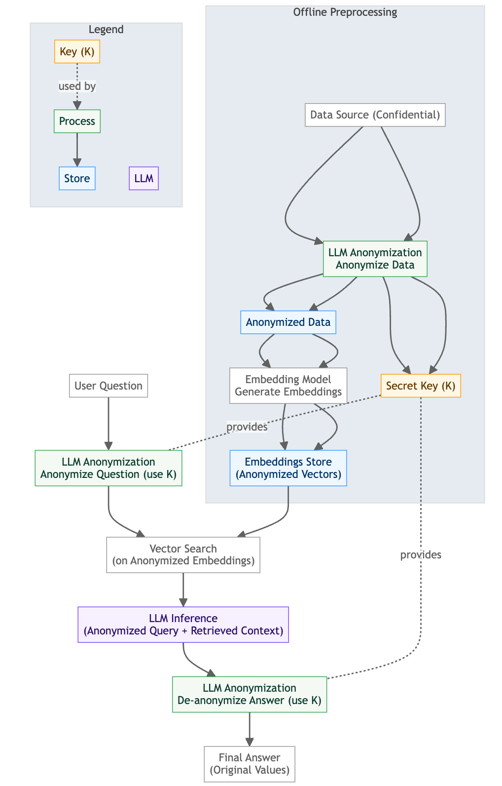

<div align="center">



# LLM Anonymization

Privacy‑first text anonymization for LLM and RAG pipelines

<a href="#-installation"></a>
<a href="#-features"></a>
<a href="#-security--key-management"></a>
<a href="#-testing"></a>
<a href="#-configuration"></a>
<a href="#-license"></a>

<br/>

**Slogan:** <b>Use confidential data with any LLM — with 100% privacy (GDPR and HIPPA Compliance).</b>

</div>

---

## 🔗 Quick Links
- [✨ Features](#-features)
- [🧠 RAG Workflow](#-how-it-works-rag-integration)
- [📦 Installation](#-installation)
- [🚀 Quickstart](#-quickstart)
- [📚 Usage Examples](#-usage-examples)
- [🧩 RAG Integration (Example)](#-rag-integration-example)
- [🛡️ Security & Key Management](#-security--key-management)
- [🧪 Tests](#-testing)
- [🔧 Public API](#-public-api)
- [⚙️ Configuration](#-configuration)
- [📈 Performance Tips](#-performance-tips)
- [🗺️ Roadmap](#-roadmap)
- [🤝 Contributing](#-contributing)

---

## ✨ Features

| Area | Highlights |
|---|---|
| **Anonymization** | Reversible tokenization (NAME1234, ORG5678…) with consistent mapping |
| **Security** | Mapping files encrypted at rest (Fernet, AES‑256) |
| **Accuracy** | spaCy NER with `sm`, `md`, `lg`, `trf` models |
| **PII Patterns** | Email, phone, SSN, credit cards, IP, addresses, IDs |
| **RAG‑Ready** | Works across preprocessing, retrieval, generation, and post‑processing |
| **Scale** | Batch processing, logging, minimal memory overhead |
| **DX** | Clean API, examples, diagram, and ready‑to‑run tests |

> Why it matters: Keep embeddings, retrieval, prompts, and LLM outputs anonymized end‑to‑end — then restore real values only at the very end using your key.

---

## ✨ Architecture Diagram



---

## 🧠 How it works (RAG integration)

1. Anonymize confidential data → save encrypted mapping + secret key `K`
2. Build embeddings from anonymized data only
3. Anonymize user question with the same key `K`
4. Retrieve with anonymized query over anonymized vectors
5. Send anonymized query + anonymized context to the LLM
6. De‑anonymize the LLM answer using key `K`
7. Display the final answer with original values

## ✨ Architecture Diagram



---

---

## 📦 Installation

```bash
# Python 3.8+
python -m venv anonymization_env
source anonymization_env/bin/activate  # Windows: anonymization_env\Scripts\activate
pip install --upgrade pip
pip install -r requirements.txt

# Install at least one spaCy model
python -m spacy download en_core_web_sm
# Recommended for higher accuracy
# python -m spacy download en_core_web_lg
```

> Tip: If you run into model errors, verify with: `python -c "import spacy; spacy.load('en_core_web_sm'); print('ok')"`.

---

## 🚀 Quickstart

```python
from TextAnonymization import TextAnonymizer

anonymizer = TextAnonymizer(model_size="lg")

text = "John Doe works at Microsoft in Seattle. Contact: john.doe@microsoft.com"

anonymized_text, mapping_df, key = anonymizer.getAnonymizeText(text)
print("Anonymized:", anonymized_text)
print("Key:", key)
print(mapping_df.head())

restored = anonymizer.getActualTextFromAnonymized(anonymized_text, key)
print("Restored:", restored)
```

---

## 📚 Usage Examples

### **Project Structure**
```
my_rag_project/
├── llm_anonymization/          # The library folder
│   ├── __init__.py
│   ├── TextAnonymization.py
│   ├── config.py
│   └── requirements.txt
├── my_app.py                   # Your application
├── documents/                  # Confidential docs
└── embeddings/                 # Vector store
```

### **Example 1: Basic Text Anonymization**
```python
# my_app.py
from llm_anonymization.TextAnonymization import TextAnonymizer

# Initialize the anonymizer
anonymizer = TextAnonymizer(model_size="lg")

# Anonymize confidential text
confidential_text = "John Doe works at Microsoft in Seattle. Contact: john.doe@microsoft.com"

anonymized_text, mapping_df, key = anonymizer.getAnonymizeText(confidential_text)

print(f"Original: {confidential_text}")
print(f"Anonymized: {anonymized_text}")
print(f"Key: {key}")
print(f"Mapping:\n{mapping_df}")

# Restore original text
restored = anonymizer.getActualTextFromAnonymized(anonymized_text, key)
print(f"Restored: {restored}")
```

### **Example 2: Document Processing for RAG**
```python
# my_app.py
from llm_anonymization.TextAnonymization import TextAnonymizer

class RAGAnonymizer:
    def __init__(self):
        self.anonymizer = TextAnonymizer(model_size="lg")
        self.documents = {}
        self.keys = {}
    
    def process_document(self, doc_id: str, content: str):
        """Anonymize a document and store the mapping"""
        anonymized_content, mapping_df, key = self.anonymizer.getAnonymizeText(content)
        
        # Store the anonymized content and key
        self.documents[doc_id] = {
            'original': content,
            'anonymized': anonymized_content,
            'key': key
        }
        self.keys[doc_id] = key
        
        return anonymized_content, key
    
    def anonymize_query(self, query: str, doc_id: str):
        """Anonymize a query using the same key as the document"""
        if doc_id not in self.keys:
            raise ValueError(f"Document {doc_id} not found")
        
        key = self.keys[doc_id]
        anonymized_query = self.anonymizer.getAnonymizedWithKey(query, key)
        return anonymized_query
    
    def de_anonymize_answer(self, answer: str, doc_id: str):
        """De-anonymize an answer using the document's key"""
        if doc_id not in self.keys:
            raise ValueError(f"Document {doc_id} not found")
        
        key = self.keys[doc_id]
        original_answer = self.anonymizer.getActualTextFromAnonymized(answer, key)
        return original_answer

# Usage
rag_anon = RAGAnonymizer()

# Process confidential documents
doc1_content = "Acme Corp signed a deal with Contoso on February 2, 2024."
doc2_content = "Contact Alice at alice@acme.com for invoices."

anon_doc1, key1 = rag_anon.process_document("doc1", doc1_content)
anon_doc2, key2 = rag_anon.process_document("doc2", doc2_content)

print("Anonymized documents:")
print(f"Doc1: {anon_doc1}")
print(f"Doc2: {anon_doc2}")
```

### **Example 3: Batch Processing**
```python
# my_app.py
from llm_anonymization.TextAnonymization import TextAnonymizer

def process_large_corpus():
    """Process a large number of documents efficiently"""
    anonymizer = TextAnonymizer(model_size="lg")
    
    # Large list of confidential documents
    documents = [
        "John Smith works at Apple in Cupertino",
        "Sarah Johnson is a developer at Facebook",
        "Mike Brown lives in New York City",
        "Lisa Davis works at Amazon in Seattle",
        # ... hundreds more documents
    ]
    
    # Process in batches
    results = anonymizer.batch_anonymize(documents, batch_size=50)
    
    # Store results
    processed_docs = []
    for i, (anonymized, mapping, key) in enumerate(results):
        if key != "FAILED":
            processed_docs.append({
                'id': f"doc_{i}",
                'anonymized': anonymized,
                'key': key,
                'entities_found': len(mapping)
            })
    
    return processed_docs

# Usage
corpus_results = process_large_corpus()
print(f"Successfully processed {len(corpus_results)} documents")
```

### **Example 4: Integration with Vector Database**
```python
# my_app.py
from llm_anonymization.TextAnonymization import TextAnonymizer
from sentence_transformers import SentenceTransformer
import faiss
import numpy as np

class AnonymizedRAG:
    def __init__(self):
        self.anonymizer = TextAnonymizer(model_size="lg")
        self.embedding_model = SentenceTransformer('all-MiniLM-L6-v2')
        self.documents = []
        self.keys = []
        self.embeddings = None
        self.index = None
    
    def add_documents(self, documents: list[str]):
        """Add and anonymize documents, then create embeddings"""
        anonymized_docs = []
        
        for doc in documents:
            # Anonymize the document
            anon_doc, mapping, key = self.anonymizer.getAnonymizeText(doc)
            anonymized_docs.append(anon_doc)
            self.keys.append(key)
        
        # Create embeddings from anonymized documents
        self.embeddings = self.embedding_model.encode(anonymized_docs)
        
        # Build FAISS index
        dimension = self.embeddings.shape[1]
        self.index = faiss.IndexFlatL2(dimension)
        self.index.add(self.embeddings.astype('float32'))
        
        self.documents = documents
    
    def query(self, question: str, top_k: int = 3):
        """Query the anonymized RAG system"""
        # Anonymize the question using the first document's key
        if not self.keys:
            raise ValueError("No documents added yet")
        
        # Use the first key for consistency (or implement key selection logic)
        key = self.keys[0]
        anonymized_question = self.anonymizer.getAnonymizedWithKey(question, key)
        
        # Create embedding for anonymized question
        question_embedding = self.embedding_model.encode([anonymized_question])
        
        # Search
        D, I = self.index.search(question_embedding.astype('float32'), top_k)
        
        # Get anonymized context
        anonymized_contexts = []
        for idx in I[0]:
            if idx < len(self.documents):
                # Get the anonymized version of the document
                anon_doc, _, _ = self.anonymizer.getAnonymizeText(self.documents[idx])
                anonymized_contexts.append(anon_doc)
        
        return {
            'anonymized_question': anonymized_question,
            'anonymized_contexts': anonymized_contexts,
            'key': key
        }
    
    def de_anonymize_answer(self, answer: str, key: str):
        """De-anonymize an answer"""
        return self.anonymizer.getActualTextFromAnonymized(answer, key)

# Usage
rag_system = AnonymizedRAG()

# Add confidential documents
confidential_docs = [
    "Acme Corp signed a deal with Contoso on February 2, 2024.",
    "Contact Alice at alice@acme.com for invoices.",
    "The project deadline is March 15, 2024."
]

rag_system.add_documents(confidential_docs)

# Query the system
question = "Who did Acme sign a deal with?"
result = rag_system.query(question)

print(f"Original question: {question}")
print(f"Anonymized question: {result['anonymized_question']}")
print(f"Anonymized contexts: {result['anonymized_contexts']}")
print(f"Key: {result['key']}")

# Simulate LLM response (in real usage, send to your LLM)
llm_response = "Acme Corp signed a deal with Contoso."
de_anon_response = rag_system.de_anonymize_answer(llm_response, result['key'])
print(f"De-anonymized response: {de_anon_response}")
```

### **Example 5: Configuration and Environment**
```python
# my_app.py
from llm_anonymization.TextAnonymization import TextAnonymizer
from llm_anonymization.config import get_model_size, get_batch_size
import os

# Set environment variables for configuration
os.environ['ANONYMIZATION_MODEL_SIZE'] = 'lg'
os.environ['ANONYMIZATION_BATCH_SIZE'] = '100'

# Initialize with custom settings
anonymizer = TextAnonymizer(
    model_size=get_model_size(),  # Will use 'lg' from env
    master_key=None  # Will generate new key
)

# Get configuration values
print(f"Model size: {get_model_size()}")
print(f"Batch size: {get_batch_size()}")

# Use the anonymizer
text = "John Doe works at Microsoft"
anonymized, mapping, key = anonymizer.getAnonymizeText(text)
print(f"Anonymized: {anonymized}")
```

---

## 🧩 RAG Integration (Example)

```python
from TextAnonymization import TextAnonymizer

# 1) Offline: anonymize docs and build embeddings
anonymizer = TextAnonymizer(model_size="lg")

docs = [
  "Acme Corp signed a deal with Contoso on Feb 2, 2024.",
  "Contact Alice at alice@acme.com for invoices."
]

anonymized_docs = []
for d in docs:
  anon_text, df, key = anonymizer.getAnonymizeText(d)  # keep the same anonymizer to reuse key
  anonymized_docs.append(anon_text)

# Build embeddings from anonymized_docs with your vector DB of choice...
# vector_db.add_texts(anonymized_docs)

# Persist key `key` and encrypted mapping file in a secure store.

# 2) Online: anonymize query with the SAME key, retrieve, LLM, then de-anonymize answer
query = "Who did Acme sign a deal with?"

# Reuse the same mapping: getAnonymizedWithKey applies existing mapping and extends if needed
anonymized_query = anonymizer.getAnonymizedWithKey(query, key)

# Retrieve against anonymized embeddings...
# hits = vector_db.search(anonymized_query)
# context = "\n".join(h.text for h in hits)

# Call your LLM with anonymized_query + anonymized_context...
# answer_anon = llm.generate(anonymized_query, context)

# De-anonymize final answer
# answer = anonymizer.getActualTextFromAnonymized(answer_anon, key)
# print(answer)
```

---

## 🛡️ Security & Key Management

> 🔒 Your data, your keys. Lose the key — lose the ability to de‑anonymize.

- Mapping files are encrypted at rest with **Fernet (AES‑128 in CBC with HMAC)**
- Random 32‑byte key by default; you can bring your own (base64 urlsafe encoded)
- Helper methods:
  - `get_raw_key() -> bytes`
  - `get_encoded_key() -> str`
- Store keys separately from mapping files; rotate keys per policy

---

## 🧪 Testing

```bash
# Optional: install larger model for better accuracy
python -m spacy download en_core_web_lg

python test_library.py
```

> The suite covers anonymization, de‑anonymization, batch, validation, model selection, and edge cases.

---

## 🔧 Public API (At a Glance)

```python
from TextAnonymization import TextAnonymizer

anonymizer = TextAnonymizer(model_size="lg", master_key=None)

# 1) Anonymize text
anonymized_text, mapping_df, key = anonymizer.getAnonymizeText(text: str, save_flag: bool = True)

# 2) Restore original text
original_text = anonymizer.getActualTextFromAnonymized(input_string: str, str_key: str)

# 3) Apply existing mapping to new text
result_text = anonymizer.getAnonymizedWithKey(text: str, key: str)

# 4) Batch process
results = anonymizer.batch_anonymize(texts: list[str], batch_size: int = 100)

# 5) Simple stats
stats = anonymizer.get_statistics()
```

---

## ⚙️ Configuration

Tunable options in `config.py`:

- Default model size (`sm` | `md` | `lg` | `trf`)
- Pattern configs (email, phone, SSN, credit cards, IP, address, IDs)
- Batch size, workers, validation, logging, storage paths

Environment overrides:

```bash
export ANONYMIZATION_MODEL_SIZE=lg
export ANONYMIZATION_BATCH_SIZE=100
export ANONYMIZATION_MAX_WORKERS=4
export ANONYMIZATION_MAX_TEXT_SIZE=1048576
```

---

## 📈 Performance Tips
- Prefer `lg`/`trf` for production accuracy; `sm` for dev speed
- Use a single key across a corpus for deterministic token mapping
- Keep encrypted mappings with data; keep keys in a separate KMS
- Batch large corpora for throughput

---

## 🗺️ Roadmap
- Deterministic token seeds
- Redaction (irreversible) mode
- Built‑in vector DB adapters for common RAG stacks
- Multilingual PII

---

## 🤝 Contributing

Contributions welcome! Please:
- Open an issue to discuss ideas/bugs
- Include tests with PRs
- Keep code readable and logged

---

## 📄 License

This project is provided as‑is for educational and development purposes. Ensure compliance (GDPR/HIPAA/etc.) for production deployments.

---

<div align="center">
  <sub>Made with ❤️ for privacy‑preserving AI. Author: Mohd Azam Email: azam.251181@gmail.com</sub>
</div>
